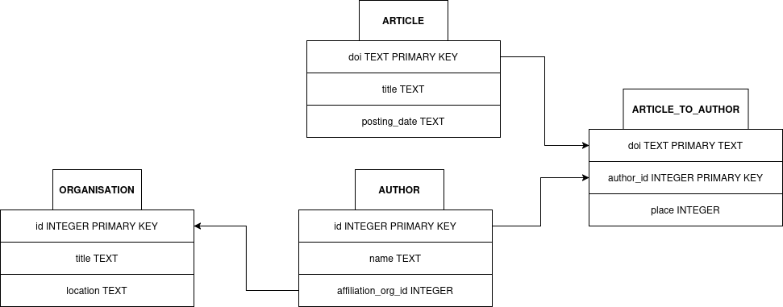

# ArticleGate

Проект по курсу "Программирование на Python" Цифровой Кафедры МФТИ

## Общее описание

WEB-приложение для организации сведений о научных публикациях.

## Структура данных

Основным сущностями в базе данных явлются таблицы author, article и organisation.

У каждого автора есть организация, с которой он аффилирован. У каждой статьи есть набор упорядоченных авторов.

Для связи статей с авторами используется таблица article_to_author. В этой таблице каждая строка хранит DOI статьи, идентификатор автора и номер его указания среди авторов рассматриваемой статьи.

## Стек технологий

+ Python3
+ FastAPI
+ SQLite3
+ SQLAlchemy
+ Pydentic
+ Pylint
